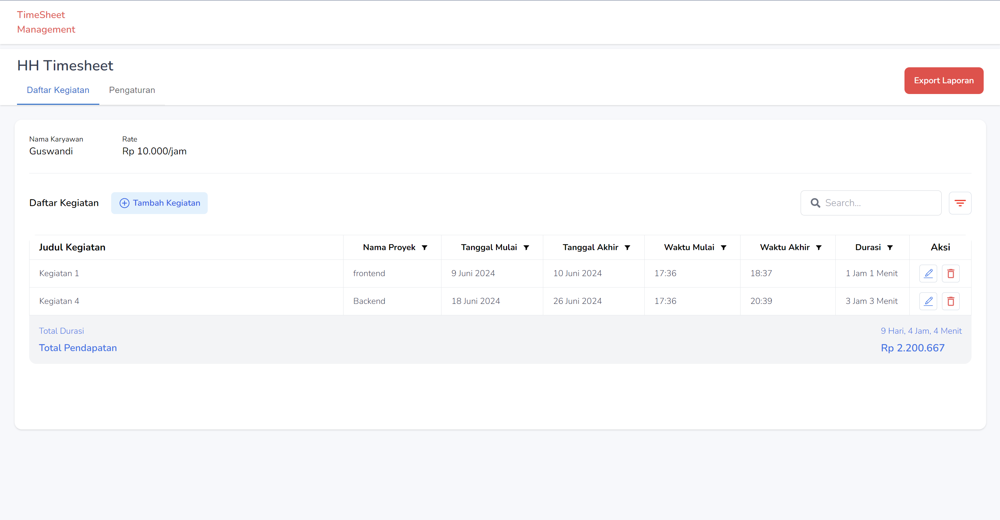
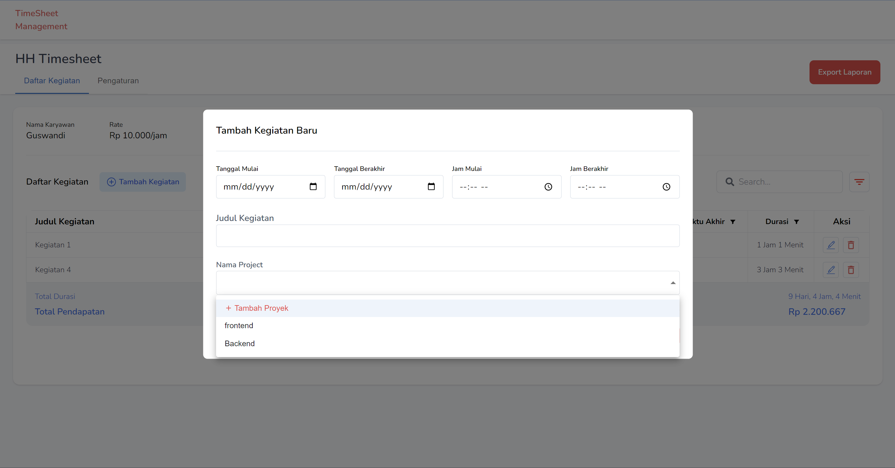
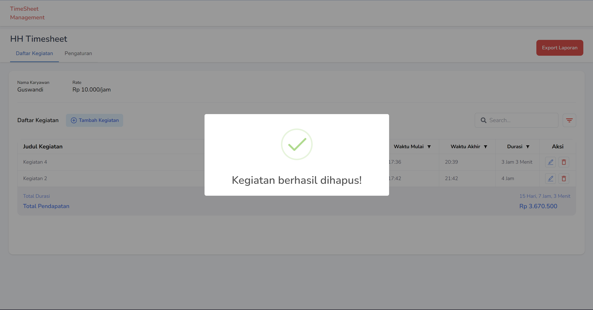
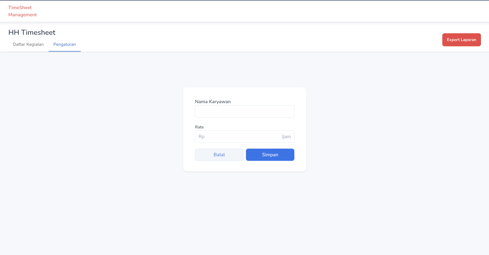
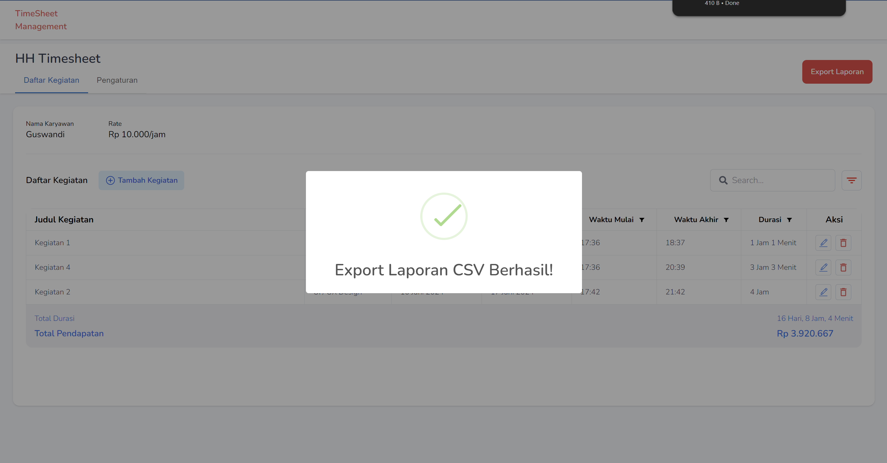

# PT Happy Homes

## Project Description

The Happy Homes application allows the addition of employees who have a varied hourly rate based on the activities and projects carried out.

## Features

The Happy Homes application has features to add employees, add activities, add projects, delete activities, and export files in CSV format.

## Tech Stack

1. **Frontend**

- NextJS, Axios, TanstackQuery, TailwindCSS, Material UI, React Hook Form

2. **Backend**

- ExpressJS, TypeORM, JsonWebToken, PostgreSQL

You can see a demo of this project at [https://timesheetmanagement.app/](https://timesheetmanagement.vercel.app/).

## Screenshots

<table>
  <tr>
    <td></td>
    <td></td>
  </tr>
  <tr>
    <td></td>
    <td></td>
  </tr>
  <tr>
    <td></td>
  </tr>
</table>

## Feedback

If you have any feedback, please reach out to us at [subqitajul7@gmail.com](mailto:subqitajul7@gmail.com)

## Authors

- [Tajul Subqi](https://github.com/tajulsubqi)
